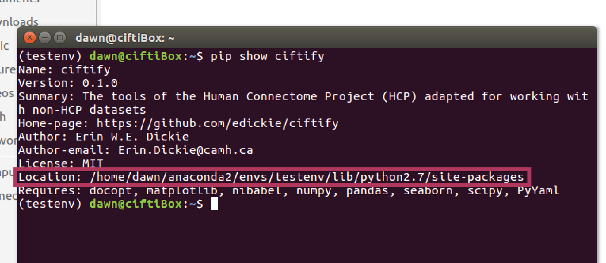
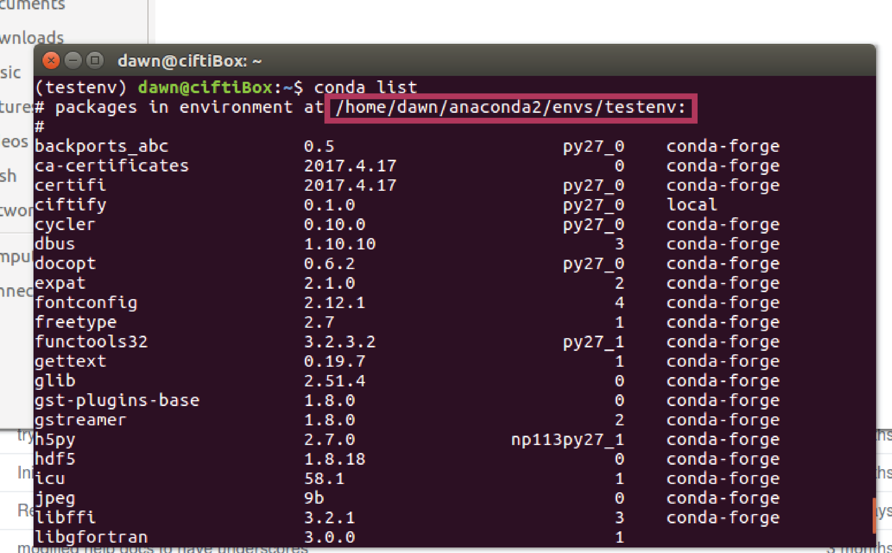

# ciftify

The tools of the Human Connectome Project (HCP) adapted for working with non-HCP datasets

*ciftify* is a set of three types of command line tools:

1. [**conversion tools**](#conversiontools) : bash scripts adapted from HCP Minimal processing pipeline to put preprocessed T1 and fMRI data into an HCP like folder structure
2. [**ciftify tools**](#ciftifytools) : Command line tools for making working with cifty format a little easier
3. [**cifti_vis tools**](#cifti_vistools) : Visualization tools, these use connectome-workbench tools to create pngs of standard views the present theme together in fRML pages.

## Check out our wiki for more details on individual tools!
https://github.com/edickie/ciftify/wiki

## Download and Install

### Install the python package
First, install the python package and all of its bundled data and scripts. You
can do this with a single command with either pip or conda if you have one of
them installed. If you don't want to use either of these tools, skip to the
'manual install' step.

To install with pip, type the following in a terminal.
```sh
pip install https://github.com/DESm1th/ciftify/archive/v0.1.0.tar.gz
```

To install with conda, type
```sh
conda install -c conda-forge ciftify
```

### Modify your path
After completing the previous step, you now need to add ciftify's bin folder
to your path. First, locate where the package was installed.

If you installed ciftify with **pip**, running the command 'pip show ciftify' in
the terminal will give you some details about ciftify and the 'location' field
will show its install location. The location to add to your path will be this
path with 'ciftify/bin' appended to the end. For example, based on the image
below ciftify's bin folder would be found at
/home/dawn/anaconda2/envs/testenv/lib/python2.7/site-packages/ciftify/bin



If you installed ciftify with **conda**, running the command 'conda list' will
show you the base path where all packages are installed. To get the exact
location of the bin folder from this append
'lib/YOURPYTHONVERSION/site-packages/ciftify/bin'. So, for example, based on the
image below and the assumption that python 2.7 is used the bin folder would be
found at /home/dawn/anaconda2/envs/testenv/lib/python2.7/site-packages/ciftify/bin

If you don't know your python version for sure you can type python --version
in the terminal to check it.



Next, add this location permanently to your PATH by modifying your .bashrc file.
The following command will accomplish this. Replace $yourpath with the path
pointing to ciftify's bin folder on your computer.

```sh
echo 'export PATH="$yourpath:$PATH"' >> ~/.bashrc
```

To check if ciftify is correctly configured, open a new terminal and type in a
ciftify command (like ciftify_vol_result). If the terminal prints the command's
help string you're good to go! Otherwise if the terminal gives you an error
like 'command not found', and your spelling of the command was correct, the path
you provided has an error in it.

### Manual installation
First clone the ciftify repo. Then set some environment variables:
+ add the `ciftify/bin` to your `PATH`
+ add the `ciftify` directory to your `PYTHONPATH`
+ create a new environment variable (`HCP_SCENE_TEMPLATES`) that point to the location of the template scene files
+ create a new environment variable (`CIFTIFY_TEMPLATES`) that points to the location of the data directory.
+ create an environment variable for the location of your `HCP_DATA`

Lastly, install the python package dependencies listed in the 'requirements'
section.

```sh
MYBASEDIR=${HOME}/code  ## change this to the directory you want to clone/download the ciftify code into

cd ${MYBASEDIR}
git clone https://github.com/edickie/ciftify.git
export PATH=$PATH:${MYBASEDIR}/ciftify/bin
export PYTHONPATH=$PYTHONPATH:${MYBASEDIR}/ciftify
export HCP_SCENE_TEMPLATES=${MYBASEDIR}/ciftify/data/scene_templates
export CIFTIFY_TEMPLATES=${MYBASEDIR}/ciftify/data

### optional: you can also set an environment variable to the location of your data
export HCP_DATA=/path/to/hcp/subjects/data/
```

---

### Possible installation issues

#### Pip/Conda gives an error like UnicodeDecodeError: 'ascii' codec can't decode byte etc. etc.
This is the result of a system that doesnt have a proper UTF-8 environment set.
It can be fixed permanently by installing the 'locales' package or fixed
temporarily (if you don't have sudo permissions) by setting the LC_ALL variable.

For example, if your system uses US english you can fix it with
```sh
export LC_ALL=en_US.UTF-8
## The above should fix it, but these variables may need to be set as well if not
export LANG=en_US.UTF-8
export LANGUAGE=en_US.UTF-8
```

## Requirements

ciftify draws upon the tools and templates of the HCP minimally processed pipelines and therefore is dependent on them and their prereqs:
+ HCP Minimal Processing Pipeline (any release) [https://github.com/Washington-University/Pipelines/releases]
+ connectome-workbench (tested with version 1.1.1) [http://www.humanconnectome.org/software/get-connectome-workbench]
+ FSL [http://fsl.fmrib.ox.ac.uk/fsl/fslwiki/]
+ FreeSurfer [https://surfer.nmr.mgh.harvard.edu/fswiki]
+ ImageMagick (for cifti-vis image manipultion)

ciftify is mostly written in python 2 (although we *believe* we are now python 3 compatible!) with the following package dependencies:

+ docopt
+ matplotlib
+ nibabel
+ numpy
+ pandas
+ pyyaml
+ seaborn (only for PINT vis)
+ scipy

## Conversion Tools

Scripts adapted from HCP Minimal processing pipeline to put preprocessed T1 and fMRI data into an HCP like folder structure

+ **ciftify_recon_all**
  + Will convert any freeserfer output directory into an HCP (cifti space) output directory
+ **ciftify_subject_fmri**
  + Will project a nifti functional scan to a cifti .dtseries.nii in that subjects hcp analysis directory
  + The subject's hcp analysis directory is created by runnning ciftify_recon_all on that participants freesurfer output
  + will do fancy outlier removal to optimize the mapping in the process and then smooth the data in cifti space
+ **cifity_vol_result**
  +  Will project a nifti scan to cifti space (4D nifti -> .dtseries.nii or 3D nifti -> .dsclar.nii) with no fancy steps or smoothing
  +  intended for conversion of 3D statistical maps (or 3D regions of interest) for visualization with wb_view

## ciftify Tools

+ **ciftify_meants**:
  + extracts mean timeseries(es) (similar to FSL' fslmeants) that can take nifti, cifti or gifti inputs
+ **ciftify_seed_corr**:
  + builds seed-based correlation maps using cifti, gifti or nifti inputs  
+ **ciftify_peaktable**:
  + similar to FSL's clusterize, outputs a csv table of peak locations from a cifti statisical map
+ **ciftify_surface_rois**:
  + a tool for building circular rois on the cortical surface. Multiple roi locations can be read at once from a csv table.
+ **ciftify_groupmask**:
  + a tools for building a group mask for statiscal analyses using multiple .dtseries.nii files as the input

## cifti_vis Tools
+ **citfi_vis_qc**:
  + builds visual qc pages for verification of ciftify_recon_all and ciftify_subject_fmri conversion
  + Note: these pages can also be used for qc of freesurfer's recon-all pipeline
  + (they easier to generate (i.e. no display needed) than freesurfer QAtools, and a little prettier too)
+ **cifti_vis_map**:
  +  generates picture of standard views from any cifti map (combined into on .html page)
  +  One can loop over multiple files (i.e. maps from multiple subjects) and combine all outputs so that all subjects can viewed together in one index page.
  +  can also take a nifti input which is internally converted to cifti using *ciftify_vol_result*
+ **cifti_vis_RSN**:
  +  From a functional file input, Will run seed-based correlations  from 4 ROIS of interest then generate pics of standard views
  +  One can loop over multiple files (i.e. maps from multiple subjects) and combine all outputs so that all subjects can viewed together in one index page.
  +  can also take a nifti input which is internally converted to cifti using *ciftify_vol_result*

## And also in the bin there is

These two are part of a work in progress (something I need to validate first)
ciftify_PINT_vertices
cifti_vis_PINT
epi_hcpexport

## References / Citing ciftify

The workflows and template files employed in ciftify were adapted from those of the Human Connectome Project's minimal proprocessing pipeline.  As such, any work employing ciftify's conversion of visualization tools should cite:

Glasser MF, Sotiropoulos SN, Wilson JA, Coalson TS, Fischl B, Andersson JL, Xu J, Jbabdi S, Webster M, Polimeni JR, Van Essen DC, Jenkinson M, WU-Minn HCP Consortium. The minimal preprocessing pipelines for the Human Connectome Project. Neuroimage. 2013 Oct 15;80:105-24. PubMed PMID: 23668970; PubMed Central PMCID: PMC3720813.

Additionally, any work employing the parcellation files included here should cite their original sources. They are:

**Yeo 7 or (17) Network Parcellation**:
Yeo, B. T. Thomas, Fenna M. Krienen, Jorge Sepulcre, Mert R. Sabuncu, Danial Lashkari, Marisa Hollinshead, Joshua L. Roffman, et al. 2011. “The Organization of the Human Cerebral Cortex Estimated by Intrinsic Functional Connectivity.” Journal of Neurophysiology 106 (3): 1125–65.

**The freesurfer DK atlas (i.e. 'aparc' segmentation)**:
Desikan, Rahul S., Florent Ségonne, Bruce Fischl, Brian T. Quinn, Bradford C. Dickerson, Deborah Blacker, Randy L. Buckner, et al. 2006. “An Automated Labeling System for Subdividing the Human Cerebral Cortex on MRI Scans into Gyral Based Regions of Interest.” NeuroImage 31 (3): 968–80.

**The Glasser MMP1.0 Parcellation**:
Glasser, Matthew F., Timothy S. Coalson, Emma C. Robinson, Carl D. Hacker, John Harwell, Essa Yacoub, Kamil Ugurbil, et al. 2016. “A Multi-Modal Parcellation of Human Cerebral Cortex.” Nature 536 (7615): 171–78.
