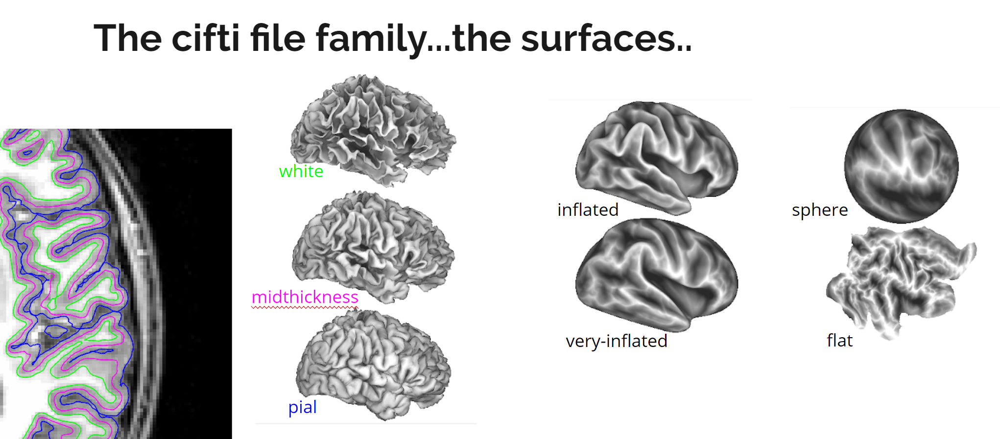

# **cifti**-**f**or-**y**our **recon_all** outputs

## ciftify_recon_all

ciftify_recon_all will convert any freesurfer recon-all output folder into an HCP style folder structure.

This is adapted from sections of Human Connectome Projects Minimal Processing Pipeline described [in this article](https://www.ncbi.nlm.nih.gov/pmc/articles/PMC3720813/) and [available in this github repo](https://github.com/Washington-University/Pipelines/releases).

The Minimal Processing Pipeline scripts require that a minimum number of HCP standard acquisitions (i.e. T1w, High Resolution T2w, etc) are present. ciftify_recon_all has been adapted from these scripts to convert ANY freesurfer output into an HCP like folder structure.  It also outputs less intermediate (unnecessary) files in the process and does standard logging to an ciftify_recon_all.log file.

### Usage

[ciftify_recon_all usage](usage/ciftify_recon_all.md ':include')

##### Required Inputs

Three arguments are required for ciftify_recon_all to run:
+ The freesurfer `SUBJECTS_DIR` is the top directory structure holding all freesurfer outputs for a sample. It can be defined either by setting the `$SUBJECTS_DIR` environment variable or using optional `--fs-subjects-dir` argument
+ The `CIFTIFY_WORKDIR` directory is the top directory holding the HCP outputs. It can be defined either by setting the `$CIFTIFY_WORKDIR` environment variable or using the optional `--ciftify-work-dir` argument
   + Note: in previous versions, this was referred to as `HCP_DATA` or `--hcp-data-dir`
+ The subject id of the participant to process. This needs to match the folder name for that subject within the freesurfer `SUBJECTS_DIR`.

### Examples

Run ciftify_recon_all after defining environment variables

```sh
export SUBJECTS_DIR=/path/to/freesurfer/outputs
export HCP_DATA=/path/for/hcp/outputs            ## will be created by fs2hcp if is does not exist
ciftify_recon_all Subject001
```

Running the same command without first defining environment variables
```sh
ciftify_recon_all --fs-subjects-dir /path/to/freesurfer/outputs --hcp-data-dir /path/for/hcp/outputs Subject001
```

### Surface Registration Options

There are currently too methods for between subject surface-based registration available with ciftify.

The default option (`MSMSulc`) matches the behaviour of the current release of the HCPPipelines.

There are two things that users should be aware of when using this method:

1. Its a very resource intensive step (it takes up to 3 hours to run)
2. It requires the newest version of the MSM software (i.e. a version newer that available with FSL)
    + visit [this link](https://www.doc.ic.ac.uk/~ecr05/MSM_HOCR_v2/) for the download and install instructions
    + this version is installed into the ciftify docker container
    + note: this software is only licensed for acedemic use

An alternative is to instead use the freesurfer (fsaverage) surface registration, by using the `--surf-reg` flag with the FS input:

```sh
ciftify_recon_all --surf-reg FS --fs-subjects-dir /path/to/freesurfer/outputs --ciftify-work-dir /path/for/hcp/outputs Subject001
```

### Generating space-T1w 32k grayordinate outputs

The most useful output "space" for fMRI and multi-modal is the "MNINonLinear/fsaverage_LR32k".
(See below for more description of grayordinate "spaces").
These are outputs are in the default run of ciftify.

For some use cases (particularly DTI analysis), the 32k grayordinate in the
participants "T1w" space are required. These are not generated by the default by `ciftify_recon_all` for space.
To generate these outputs, use the  `--resample-to-T1w32k` flag.

```sh
ciftify_recon_all \
 --resample-to-T1w32k \
 --fs-subjects-dir /path/to/freesurfer/outputs \
 --hcp-data-dir /path/for/hcp/outputs Subject001
```

### Understanding the Outputs

There are a lot of expected outputs in the HCP-like folder structure...

A (still complicated) overview of the output folder structure is below

```
<subject>
├── ciftify_recon_all.log
├── MNINonLinear
│   ├── <subject>.164k_fs_LR.wb.spec
│   ├── .. MNINonLinear space volumes (NIfTI files)
│   ├── .. 164k surfaces (GIFTI), labels & anatomical data (CIFTI)
│   ├── fsaverage_LR32k
│   │   ├── <subject>.32k_fs_LR.wb.spec
│   │   └── .. 32k surfaces (GIFTI), labels & anatomical data (CIFTI)
│   ├── Native
│   │   ├── <subject>.native.wb.spec
│   |   ├── .. native (i.e. FreesSurfer mesh) surfaces
│   |   └── .. spheres for resampling from freesurfer to HCP's "fsaverageLR"
│   ├── Results
│   |   └── .. the fMRI results will be written to here
│   ├── ROIs
│   |   └── .. ROIs for subcortical resampling
│   └── xfms
│       └── .. FSL transforms from T1w space
└── T1w
    ├── <subject>.164k_fs_LR.wb.spec
    ├── .. T1w space volumes (NIfTI files)
    ├── .. 164k surfaces (GIFTI), labels & anatomical data (CIFTI)
    ├── Native
    |  ├── <subject>.native.wb.spec
    │  └── .. native (i.e. FreesSurfer mesh) surfaces
    └── fsaverage_LR32k (if --resample-to-T1w32k flag used)
         ├── <subject>.32k_fs_LR.wb.spec
         └── .. 32k surfaces (GIFTI), labels & anatomical data (CIFTI)
```

#### Understanding Spaces

Your HCP-like output data is sorted into several "spaces". "Space" for any output is defined by two major things:
1. The volume space. The location of the data in the 3 dimensional volume.
2. The surface mesh. The spacing of the surface vertices.

Each space is associated with its own "spec" file, which allow all files that relate to a certain space to be loaded at once.

```
<subject>
├── MNINonLinear
│   ├── <subject>.164k_fs_LR.wb.spec
│   ├── fsaverage_LR32k
│   │   └── <subject>.32k_fs_LR.wb.spec
│   ├── Native
│   │   └── <subject>.native.wb.spec
 to HCP's "fsaverageLR"
└── T1w
    └── <subject>.164k_fs_LR.wb.spec
    ├── Native
    |  └── <subject>.native.wb.spec
    └── fsaverage_LR32k (if --resample-to-T1w32k flag used)
         └── <subject>.32k_fs_LR.wb.spec
```

| Volume Space | surface mesh | location of spec file | Important for |
|---|---|---|---|
| MNINonLinear |  32k_fs_LR | `MNINonLinear/fsaverage_LR32k/<subject>.32k_fs_LR.wb.spec` | fMRI and multimodal analysis, most atlases are available in this space |
| T1w |  32k_fs_LR | `T1w/fsaverage_LR32k/<subject>.32k_fs_LR.wb.spec` | seeds for DTI analysis, anatomical measurements (i.e. surface area) |
| MNINonLinear |  164k_fs_LR | `MNINonLinear/<subject> .164k_fs_LR.wb.spec` | high-res anatomical analysis |
| T1w |  164k_fs_LR | `T1w/<subject>.164k_fs_LR.wb.spec` | |
| MNINonLinear |  Native | `MNINonLinear/Native/<subject>.native.wb.spec` | the 'fsaverage' mesh |
| T1w |  Native | `T1w/Native/<subject>.native.wb.spec` | the 'fsaverage' mesh |

To really understand what these spaces look like (and contain) I recommend opening the spec files in the connectome-workbench viewer (wb_view)

```sh
wb_view <subject>/MNINonLinear/fsaverage_LR32k/<subject>.32k_fs_LR.wb.spec
```

#### connetome-workbench/HCP neuroimaging data types

If you are familiar with neuroimaging data analysis using the NIfTI file format. You are probably used to the idea, that NIfTI files can hold different types of information (fMRI data, output stats, and masks). In GIFTI or CIFTI file format, these different types of information are associated with different file extensions. The connectome-workbench viewer (and some `wb_command` functions) will act differently for each type.

| data type | timeseries | scalars/metrics | labels |
|---|
| **What it holds** | Data where the last dimension has some known interval (i.e. seconds in time) | Data where each column/map can be named (like a spreadsheet) | Data were every value in a column can hold a name (string) and an integer value. |
| **example MR use case** | fMRI timeseries | thickness, statistical maps | ROI’s, atlases |
| **cifti extension** | .dtseries.nii | .dscalar.nii | .dlabel.nii |
| **gifti extension** | .func.gii     | .shape.gii   | .label.gii  |
| **nifti extension** | .nii.gz       | .nii.gz      | .nii.gz     |

#### The many surfaces of a brain

From one anatomical scan. The 3D coordinates for the location of any vertex could be described in several ways.

The HCP naming format. These files follow the naming convention:

`<subject>.<hemisphere>.<surface_type>.<surface_mesh>.surf.gii` where:
+ `<subject>`: the subject identifier
+ `<hemisphere>`: `L` for left or `R` for right
+ `<surface_type>`: the type of surface (i.e. "white"). See below for all options
+ `<surface_mesh>`: the cortical mesh name (i.e. "32k_fs_LR") See [understanding spaces](#understanding-spaces) for more details.



| surface | description | useful for |
|---|---|---|
| white   | The border between the gray matter and the white matter | defines the inside of the cortical ribbon |
| pial    | The border between the gray matter and the outside of the brain (pia matter) | defines the outsite of the cortical ribbon |
| midthickness | The midpoint between the white surface and pial surface | measuring distance and surface area |
| sphere | The surface vertices as a sphere | registration and resampling |
| inflated | The midthickness is blown up like a balloon | visualiation |
| very-inflated | The midthickness is blown up like a balloon _more_ | visualizations |
| flat | the cortex ripped apart | visualizations (one less intuitive view of the entire hemisphere) |


## cifti_vis_recon_all

### Prerequisites

Before building recon-all qc pages you will need to:

1. Run Freesurfer's recon-all on your dataset
2. Run ciftify_recon_all on your dataset to convert your data to cifti format.

### Running cifti_vis_recon-all

cifti_vis_recon_all is run in two steps:
1. the *snaps* step is used to create qc images for one subject
   + this step needs to be repeated for each subject in your dataset
2. the *index* step is used to write summary html pages where all subjects from your dataset can be viewed together
   + this step is very fast, but requires the outputs of the first "snaps" step.

#### Generating snaps for one subject

Assuming your `CIFTIFY_WORKDIR` folder contains outputs of ciftify_recon_all are organised like this.

Note: in previous versions, `CIFTIFY_WORKDIR` was referred to as `HCP_DATA` or `--hcp-data-dir`

```
/path/to/my/CIFTIFY_WORKDIR
├── subject_01
├── subject_02
...
└── subject_n
```
We would run generate QC outputs for `subject_01`, after setting the CIFTIFY_WORKDIR environment variable using the following command.

```sh
export CIFTIFY_WORKDIR=/path/to/my/CIFTIFY_WORKDIR   ## set the CIFTIFY_WORKDIR environment variable
cifti_vis_recon_all snaps subject_01
```

#### To run all subjects in the dataset and then build the index..

```
export CIFTIFY_WORKDIR=/path/to/my/CIFTIFY_WORKDIR   ## set the CIFTIFY_WORKDIR environment variable

## make a subject list
subject_list=`cd ${CIFTIFY_WORKDIR}; ls -1d subject*`

## make snaps for all subjects
for subject in ${subject_list};
  do
  cifti_vis_recon_all snaps ${subject}
done

## make the index pages
cifti_vis_recon_all index
```

#### Optional Arguments

Alternatively, the `CIFTIFY_WORKDIR` directory location can be specified as an optional argument. This will override the `$CIFTIFY_WORKDIR` environment variable.

```sh
cifti_vis_recon_all subject --ciftify-work-dir /path/to/my/CIFTIFY_WORKDIR subject_01
```

By default, the qc visualizations will be written to a folder called `qc_recon_all` inside the `CIFTIFY_WORKDIR` directory. Alternatively, the location of qc outputs can be set using the `--qcdir` option

```sh
cifti_vis_recon_all subject --qcdir /path/to/my/qc_outputs subject_01
```


#### A little fancier, running on a cluster using gnu-parallel

cifti_vis_recon_all is pretty input-output intensive. Which tends to make everything slower on a large cluster. (and cluster administrators very mad at you).  So this script first write the files to "ramdisk" (super fast local storage, at /dev/shm) then tars up all the qc images before writing them to disk.

```sh
#!/bin/bash
#PBS -l nodes=1:ppn=8,walltime=5:00:00
#PBS -j oe

#load the enviroment
module load gnu-parallel/20140622             # needed to run the "parallel" command below
source ${HOME}/myscripts/abide/ciftify_env.sh # loading the ciftify environment
module load ImageMagick                       # required by QC page generator

export SUBJECTS_DIR=${SCRATCH}/myproject/FSout/
export CIFTIFY_WORKDIR=${SCRATCH}/myproject/hcp/

## get the subjects list from the CIFTIFY_WORKDIR list
cd ${CIFTIFY_WORKDIR}
subjects=`ls -1d subject*` ## EDIT THIS LINE with pattern for your subject ids

## Add a projectname to the output directory
projectname="myprojectname" ## EDIT THIS LINE with your projectname

###############
## this part is bash magik for creating a tmp directory that get's deleted if/when the job dies

tmpdir=$(mktemp --tmpdir=/dev/shm -d tmp.XXXXXX)

function cleanup_ramdisk {
    echo -n "Cleaning up ramdisk directory ${tmpdir} on "
    date
    rm -rf ${tmpdir}
    echo -n "done at "
    date
}

#trap the termination signal, and call the function 'trap_term' when
# that happens, so results may be saved.
trap cleanup_ramdisk EXIT

####################

# This part write all the QC snaps and html pages to tmp directory...than tars is all up and copies it to the file system

## run the QC - note it's a little faster because we are running the snaps generation in parallel across subjects
qcdir="qc_${projectname}_recon_all"
parallel -j 4 "cifti_vis_recon_all subject --qcdir ${tmpdir}/${qcdir} {}" ::: $subjects
cifti_vis_recon_all index --qcdir ${tmpdir}/${qcdir}

## move the data from the ramdisk back to CIFTIFY_WORKDIR
cd ${tmpdir}
tar -cf ${CIFTIFY_WORKDIR}/${qcdir}.tar ${qcdir}/
rm -r ${tmpdir}/${qcdir}
cd ${CIFTIFY_WORKDIR}

```
## Looking at cifit_vis_recon_all outputs

We will start with the outputs from "MNIfsaverage32k" qcmode. In these views, the surfaces have been transformed into MNI space using FSL fnirt.  

This is actually quite useful for visual QC because:
1. All subjects are oriented the same way - which makes outliers easier to spot.
2. Some errors in tissue classification will get exaggerated by the MNI transform - making them easier to spot here.  

#### My QC workflow

If the qc pages are on your local system you can view them using your browser

```sh
firefox /path/to/hcp/data/qc_recon_all/index.html
```
My QC workflow is:
1. Scroll through the [CombineView Index Pages](#the-combined-qc-view)
   + if any image looks odd, click on that subject to view the [single subject view](#single-subject-view) and investigate further
2. Scroll through the [Sagittal Surface Outline View](#the-sagittal-surface-outline-view)
   + if any image looks odd, click on that subject to view the [single subject view](#single-subject-view) and investigate further

Throughout this process. Make notes about any poor scans in a separate document.

### Single Subject View

The single subject views shows all snapshots taken from this subject in one page. The views are (from top to bottom).

1. **MNI_LRDV**: Midthickness Surfaces in MNI Space - with Automatic Parcellation (aparc, Left/Right/Dorsal/Ventral)
2. **MNI_LM**: Midthickness Surfaces in MNI Space - with Automatic Parcellation (aparc, Lateral/Medial)
3. **MNI_surf_Ax**: White and Pial Surfaces in MNI Space (Axial View)
4. **MNI_surf_Sag**: White and Pial Surfaces in MNI Space (Sagittal View)
5. **MNI_surf_Cor**: White and Pial Surfaces in MNI Space (Coronal View)
6. **aseg_Ax**: Freesurfer Automatic Segementation (aseg) in "Native" T1w Space (Axial View)
7. **aseg_Sag**: Freesurfer Automatic Segementation (aseg) in "Native" T1w Space (Sagittal View)
8. **aseg_Cor**: Freesurfer Automatic Segementation (aseg) in "Native" T1w Space (Coronal View)
9. **Index**: the surface reconstruction on top of the anatomical. Lateral (L and R) and Dorsal and Vental views.


### The combined QC view

This index page shows the surface reconstruction of the brain (labeled using the aparc atlas) with the T1w Image. You see the brain from the 1) Left Side, 2) Right Side 3) Top View 4) Bottom View

Every line is a separate subject. The freesurfer subject ID is printed below the image. To look at any subject in more detail - click on the image.


In the image above all subjects pass visual QC.

### Examples of QC fails

If recon-all did not finish. The surface files might not exist... so they are not plotted.  


A completely black image may be seen is recon-all failed very early in the pipeline..

For a very poor quality anatomical. The surface will look shrivelled up.


Sometimes when brain masking fails during recon-all in a part of the brain, than area of the brain will be stretched strangely in the underlying image. (image to come)

If the gray matter is missing part of the occipital lobe, the back of the brain will look split apart on the bottom view (far right)


#### The Sagittal Surface Outline View

The is the second place to look. Like the Combined View - index page, here we see one line per subject, with the the Freesurfer subject id printed below. Also, like all index pages, you can go to the single subject view by clicking on any subject's image.


In the above image, all of the participants pass visual QC.

##### Examples of QC fails

A key place to look are the two temporal poles. Surface reconstruction in these area can fail.


For this participant, the surface reconstruction in the aparc view looks jagged (especially in the orbital frontal cortex)


##### Examples of QC - not ideal

The temporal pole is not ideal.


