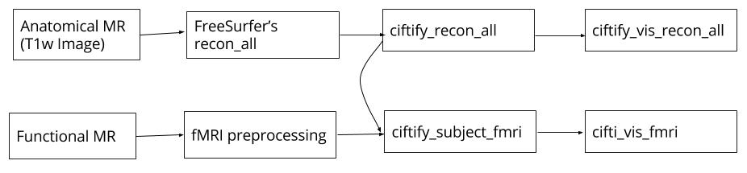

# ciftify usage example


The following example uses data from the Consortium for Neuropsychiatric Phenomics (CNP) dataset described in (Poldrack et al. 2016). This data was obtained from the OpenfMRI database. Its accession number is ds000030. In this example we, work from the proprocessed data release v1.0.4. The release includes both structural outputs preprocessed with freesurfer (version 6.0.0, (Fischl 2012)) and resting state fMRI data preprocessed with the fmriprep pipeline (see (Gorgolewski et al. 2017)).

## Step one download the data

We will download and unzip the freesurfer and fmriprep outputs from subjects 50004-50008
```sh
cd /local/source/dir ## change this to the location of the files on your system
## the fmriprep outputs
wget https://s3.amazonaws.com/openneuro/ds000030/ds000030_R1.0.4/compressed/ds000030_R1.0.4_derivatives_sub50004-50008.zip
unzip ds000030_R1.0.4_derivatives_sub50004-50008.zip
wget https://s3.amazonaws.com/openneuro/ds000030/ds000030_R1.0.4/compressed/ds000030_R1.0.4_derivatives_freesurfer_sub50004-50008.zip
unzip ds000030_R1.0.4_derivatives_freesurfer_sub50004-50008.zip
```

This outputs are organized into BIDS data structure for "deritives" calculated in this manner.
Speciftically, all outputs are nested within subfolders "freesurfer" (for freesurfer)
and "fmriprep" (for fmri), which are sitting within ds000030_R1.0.4/derivatives.
Within the freesurfer subfolder are the full freesurfer recon-all data structure where subject id is the
top level and folders (label, mri, etc) sit below that.
The fmriprep derivatives also are organized into a subfolder for each participant.
Within these folders sit anatomical ("anat") and functional ("func") derivatives.
For ciftify, we require the preprocessed fmri data in T1w ("native") space.
In this example, we will select the resting state run. For participant sub-50005,
this file is named "sub-50005_task-rest_bold_space-T1w_preproc.nii.gz"

```
ds000030_R1.0.4
└── derivatives
    ├── fmriprep
    │   ├── sub-50005
    |   │   ├── anat
    │   │   └── func
    |   |       ├── sub-50004_task-rest_bold_space-T1w_preproc.nii.gz
    |   |       └── ...   
    │   ├── sub-50006...
    │   └── sub-...
    └── freesurfer
        ├── sub-50005
        │   ├── label
        │   ├── mri
        │   ├── scripts
        │   ├── stats
        │   ├── surf
        │   ├── tmp
        │   ├── touch
        │   └── trash
        ├── sub-50006...
        └── sub-...

```

## loading the ciftify package

For installation instructions [ visit the installation page. ](../01_installation.md)

If you are in a tutorial. There is probably an local install of the ciftify package to you learn with. [ Visit this page for instructions to source the environment ](../01_installation.md)

## The ciftify workflow



## running ciftify_recon_all for participant sub-50004

This step converts a subjects freesurfer output into an HCP-like structural anatomy output.

```sh
ciftify_recon_all --hcp-data-dir /local_dir/ciftify --fs-subjects-dir /local_dir/ds000030_R1.0.4/derivatives/freesurfer sub-50005
```

## building qc snaps after recon-all

After we convert the files we should check the quality of the outputs. The following functions will creates snapshots for quality assurance and html pages for visualizing then together

Note: the `snaps` step is run once per participant. The `index` steps can be run once at the end.

```sh
cifti_vis_recon_all snaps --hcp-data-dir /local_dir/ciftify sub-50005
cifti_vis_recon_all index --hcp-data-dir /local_dir/ciftify
```

## running ciftify_subject_fmri

Now that we have the surfaces. We can use `ciftify_subject_fmri` to map our **preprocessed** fMRI data to our subjects' surfaces (as well as resample the subcortical data).  

```sh
ciftify_subject_fmri --hcp-data-dir /local_dir/ciftify /local_dir/ds000030_R1.0.4/derivatives/fmriprep/sub-50005/func/sub-50005_task-rest_bold_space-native_preproc.nii.gz sub-50005 rest
```

## building qc snaps from fmri

The next steps generates quality assurance images for the fmri data.

```sh
cifti_vis_fmri snaps --hcp-data-dir /local_dir/ciftify rest sub-50005
cifti_vis_fmri index --hcp-data-dir /local_dir/ciftify
```

## Example outputs

A zip file of the expected outputs for sub-50005 as well as QA images for sub-50004-sub-50008 can be downloaded from [here](https://drive.google.com/open?id=0B7RQvc5-M37_dVFNd09zTkhBTzA).
